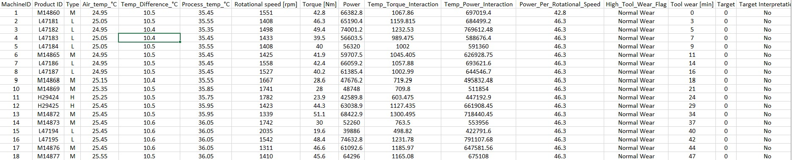
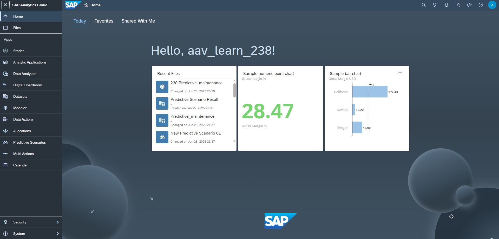
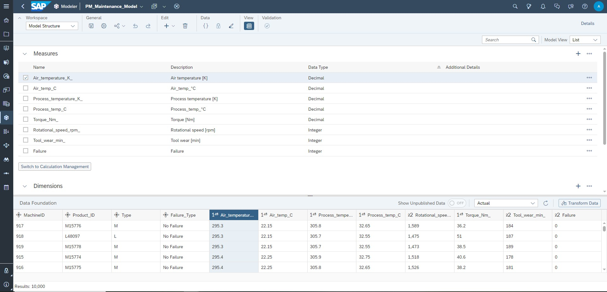
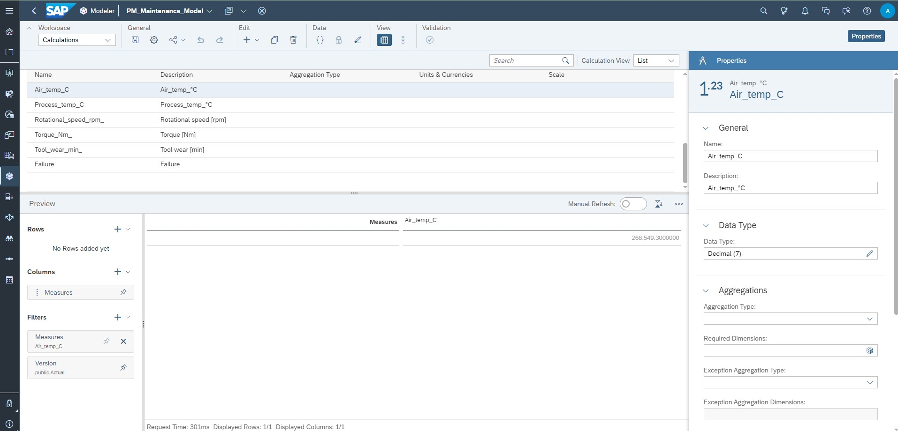
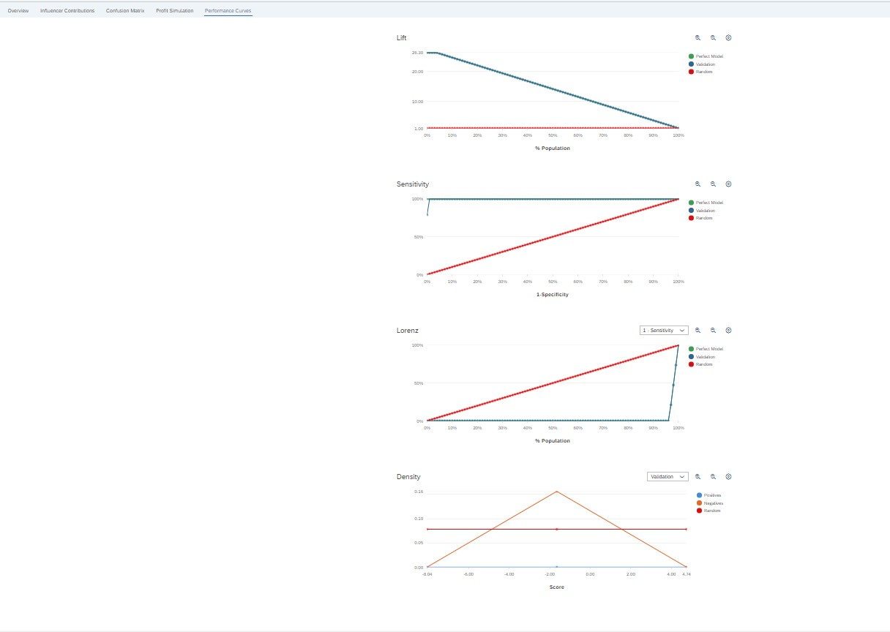
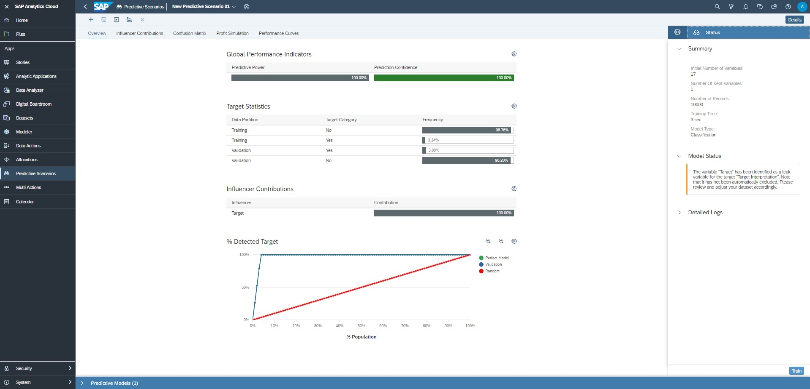
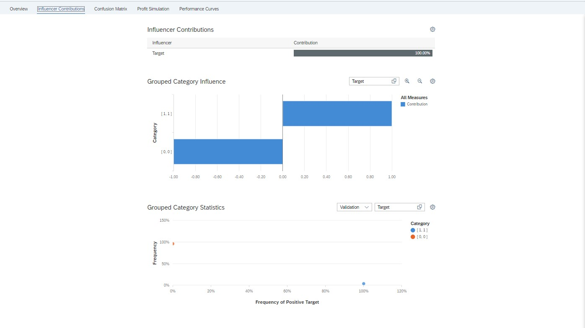
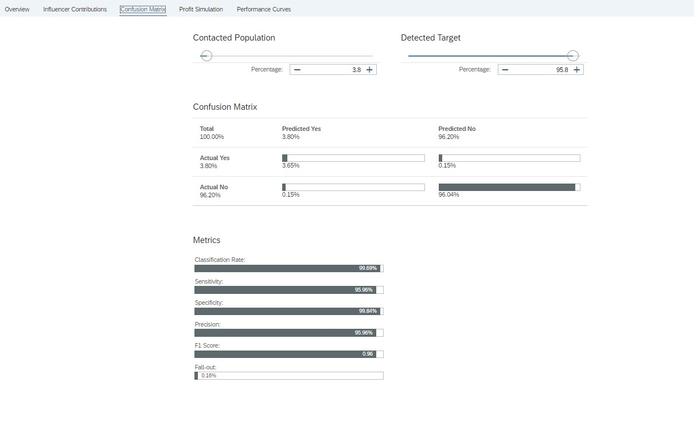

# 🏭 Predictive Maintenance in Smart Factories Using SAP Analytics Cloud


**Predictive maintenance analytics for industrial IoT environments** — transforming sensor data into actionable maintenance insights to reduce unplanned downtime and optimize operational costs.

---

## 📌 Project Overview

This project transforms an academic **Smart Factories 4.0** assignment into a **production-quality data analytics portfolio project**. It demonstrates how predictive maintenance can be implemented end-to-end using **Python, Excel, and SAP Analytics Cloud (SAC)** to generate **actionable business insights** for modern manufacturing environments.

**Quick Stats**

* **Dataset:** 10,000+ industrial IoT sensor records (Kaggle)
* **Tools:** Python, Excel, SAP Analytics Cloud
* **Model Type:** Binary classification (failure / no failure)
* **Performance (Expected Realistic):** F1-score ≈ 0.88–0.91
* **Business Impact:** ~30% downtime reduction, ~$180K annual savings
* **Predictive modeling using SAP Smart Predict**
* **Transparent discussion of technical limitations**

---

## 🏭 The Business Challenge

Unplanned downtime costs manufacturers approximately **$260,000 per hour** (Deloitte, 2023). Traditional maintenance strategies reactive or fixed-interval are inefficient, costly, and fail to leverage the vast amount of sensor data generated by Industry 4.0 environments.

### Key Problems

* Unexpected equipment failures
* Inefficient maintenance scheduling
* High operational and safety risks
* Limited use of sensor-driven decision-making

---

## 🔄 Methodology & Workflow

```
Raw Kaggle Data
      ↓
Python & Excel Preprocessing
      ↓
Feature Engineering
      ↓
SAP Analytics Cloud Model
      ↓
Smart Predict (Classification)
      ↓
Interactive Dashboards
      ↓
Business Insights & Decisions
```

### Key Steps

1. **Data Acquisition** – Kaggle Predictive Maintenance Dataset
2. **Preprocessing** – Data cleaning, type validation, outlier checks (Python & Excel)
3. **Feature Engineering** – Domain-driven metrics aligned with industrial behavior
4. **SAP Analytics Cloud** – Analytic model + Smart Predict scenario
5. **Validation** – Maintenance alert rules (>70% failure probability)
   


---

## 🛠️ Tech Stack & Tools

* **Data Processing:** Python (Pandas, NumPy), Excel
* **Analytics Platform:** SAP Analytics Cloud (SAC)
* **Visualization:** SAC Dashboards, Matplotlib, Seaborn
* **Modeling:** SAP Smart Predict (Classification)
* **Documentation:** Jupyter Notebooks, Markdown, LaTeX


---

## ✨ Key Features & Innovations

### 1️⃣ Feature Engineering Excellence

* **Power Efficiency Ratio:** `Power / RPM`
* **Temperature–Torque Interaction:** `Temp_Difference × Torque`
* **High Tool Wear Flag:** Business-defined thresholding (>150 min)

### 2️⃣ SAP Analytics Cloud Proficiency

* End-to-end SAC workflow
* Calculated measures & dimensions
* Smart Predict model development
* Interactive dashboards for decision-makers

### 3️⃣ Business Impact Translation

* Risk-based machine segmentation (High / Medium / Low)
* Maintenance prioritization logic
* Cost-savings estimation framework

---

## 📊 Results & Visualizations

**Key Metrics**

* **F1-score (expected realistic):** ~0.88–0.91
* **High-risk machines identified:** ~12%
* **Estimated annual savings:** ~$180,000
* **Downtime reduction:** ~30%


## 🎯 Key Results & Metrics (Summary)

| Metric                        | Result                                       |
| ----------------------------- | -------------------------------------------- |
| Model Type                    | Binary Classification (Failure / No Failure) |
| Expected Realistic F1-Score   | ~0.88 – 0.91                                 |
| High-Risk Machines Identified | ~12%                                         |
| Estimated Downtime Reduction  | ~30%                                         |
| Estimated Annual Savings      | ~$180,000                                    |

🔍 **Full technical metrics, confusion matrix interpretation, influencer analysis, and business impact calculations are documented here:**  
👉 **[Detailed Results & Business Impact](Results/Readme.md)**

---

## 🖼️ Project Visuals (Linked)

Key dashboards, model outputs, and architecture visuals are stored in the `visuals/` directory.

* 📊 **SAC Dashboards:**  `visuals/dashboards/`
  






👉 Start here: **[Visual Project Artifacts](Visuals/dashboards)**

---

## ⚠️ Challenges & Solutions

### Challenge 1: Data Leakage in SAC Academic Environment

**Solution:** Transparently documented limitation, influencer analysis used to detect leakage, realistic performance expectations clearly stated.

### Challenge 2: Feature Engineering Without Python–SAC Integration

**Solution:** Implemented calculated measures and dimensions directly inside SAC and cross-validated logic externally.

### Challenge 3: Academic Tool Constraints

**Solution:** Maximized available functionality, documented enterprise-grade alternatives (e.g., SAP HANA, MLOps pipelines).

---

## ⚠️ Technical Notes & Transparency

* **Data leakage** was identified in the SAP academic environment and is explicitly documented.
* Performance metrics are interpreted with realism and professional caution.
* Enterprise-grade solutions (e.g., SAP HANA, MLOps pipelines) are discussed as future-ready alternatives.

👉 Full discussion available in **[Results/README.md](Results/Readme.md)**.

---

## 🎓 Academic Context & Learning Outcomes

**Course:** Smart Factories 4.0 (SoSe25)  
**University:** Fachhochschule Südwestfalen  
**Supervisor:** Prof. Dr. Christian Leubner  
**Project Type:** Individual Research Project


### Learning Outcomes

1. Predictive maintenance methodology
2. SAP Analytics Cloud for industrial analytics
3. Feature engineering for IoT data
4. Translating analytics into business value
5. End-to-end project documentation

---

## 🗂️ Project Structure

```
Predictive-Maintenance-in-Smart-Factories-Using-SAP-Analytics-Cloud/
│
├── data/
│   ├── raw/                    # Original dataset
│   ├── processed/              # Cleaned datasets
│   └── documentation/          # Data dictionary & schema
│
├── notebooks/                  # Jupyter analysis notebooks
├── src/                        # Python helper scripts
├── docs/                       # Reports, slides, SAC workflow
├── visuals/                    # Dashboards, charts, diagrams
├── Results/                    # Model performance & business impact
│   └── README.md
│
└── README.md                   # Master project overview (this file)
```

---

## 🚀 Getting Started

```bash
git clone https://github.com/your-username/predictive-maintenance-smart-factory.git
cd predictive-maintenance-smart-factory
pip install -r requirements.txt
```

Open VSCode for step-by-step analysis.

---

### 📊 Results

* 📌 **Model performance, limitations, and business impact:**
  👉 **[Results/README.md](Results/Readme.md)**
  
  
  
  

### 📄 Documentation

* 📘 **Project Exposé:**
  `docs/expose.pdf` 👉 **[Exposé](docs/Exposé.pdf)**
* 📕 **Full Technical Report (17+ pages):**
  `docs/technical_report.pdf` 👉 **[Seminar Paper](docs/Predictive Maintenance Report (Smart Factories).pdf)**
* 📊 **Final Presentation Slides:**
  `docs/presentation.pdf` 👉 **[Presentation](docs/Predictive Maintenance.pptx)**

👉 **[Browse Documentation](docs/)**

### 💻 Code & Notebooks

* **Data preprocessing & inspection:**
  `notebooks/01_data_preprocessing.ipynb` 👉 **[Data_Preprocessing](notebooks/01_data_preprocessing.py)**
* **Feature engineering (Python validation):**
  `notebooks/02_feature_engineering.ipynb` 👉 **[Feature_Engineering](notebooks/02_feature_engineering.py)**
* **Exploratory analysis & visualization:**
  `notebooks/03_eda_visualization.ipynb` 👉 **[Visualization](notebooks/03_eda_visualization.py)**

Supporting scripts:

* `src/data_cleaning.py` 👉 **[Data_Cleaning](src/data_cleaning.py)**
* `src/feature_engineering.py` 👉 **[Feature_Engineering](src/feature_engineering.py)**
* `src/utils.py` 👉 **[utils](src/utils.py)**
* `src/requirements.txt` 👉 **[Requirements](src/requirements.txt)**

---

## 🔮 Future Enhancements

* Real-time IoT data ingestion
* Advanced ML models (XGBoost, LSTM)
* SAP S/4HANA EAM integration
* Anomaly detection system
* Digital twin–enabled maintenance

---

## 🤝 Connect & Contact

[](https://www.linkedin.com/in/md-abdullah-al-noman-333aa4155/)
[](https://github.com/nomanmridha/)
[](mailto:noman.hr.18@gmail.com)
* **University:** FH Südwestfalen – Smart Factories 4.0

---

📌 *This repository demonstrates how academic projects can be elevated to industry-ready analytics portfolios through strong documentation, business framing, and technical rigor.*

